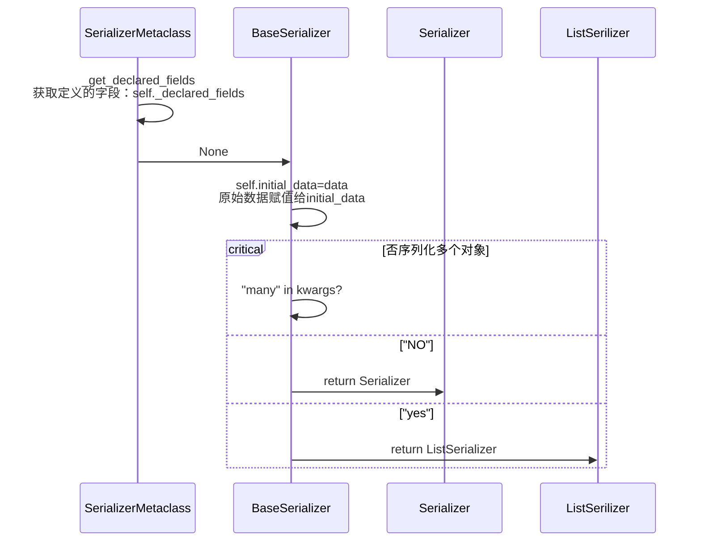
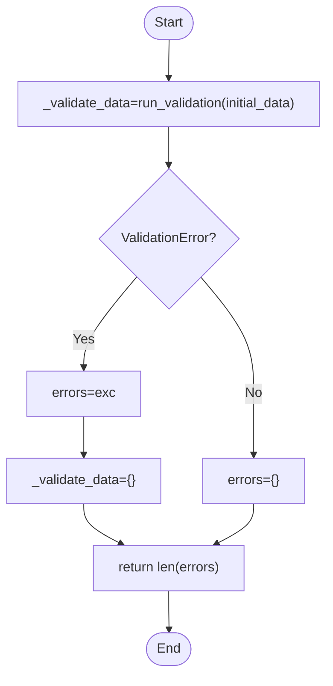
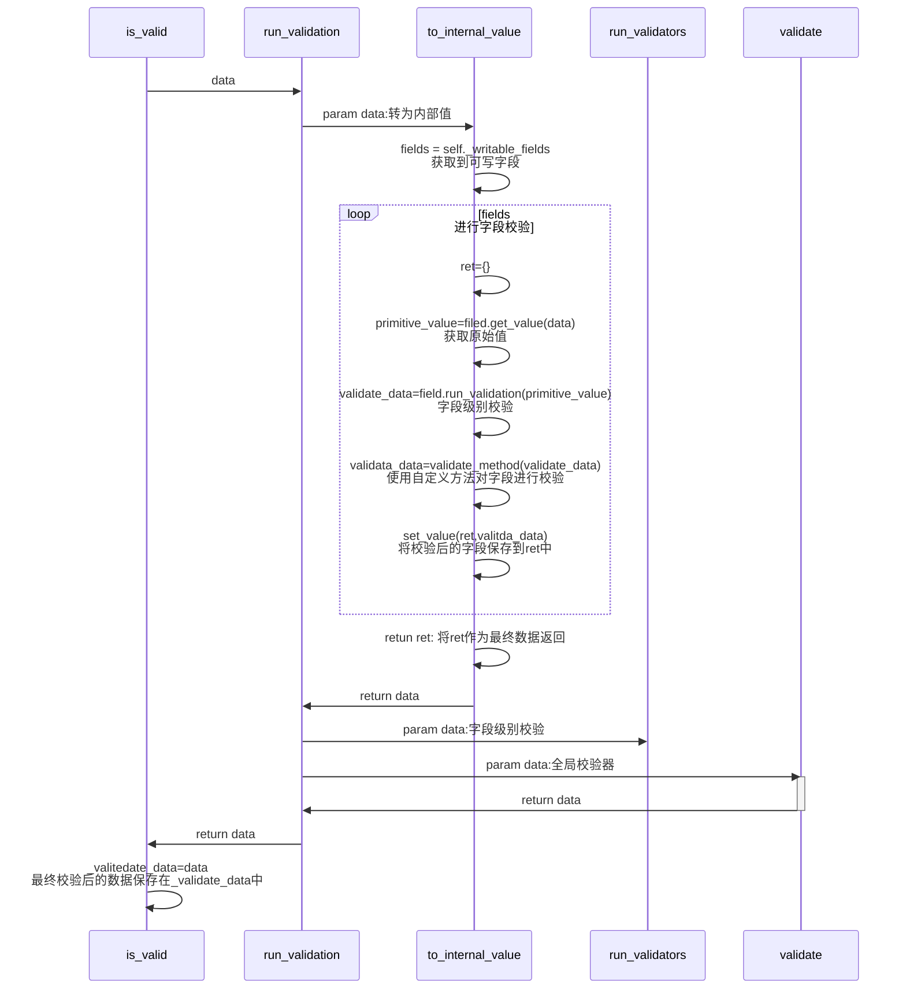
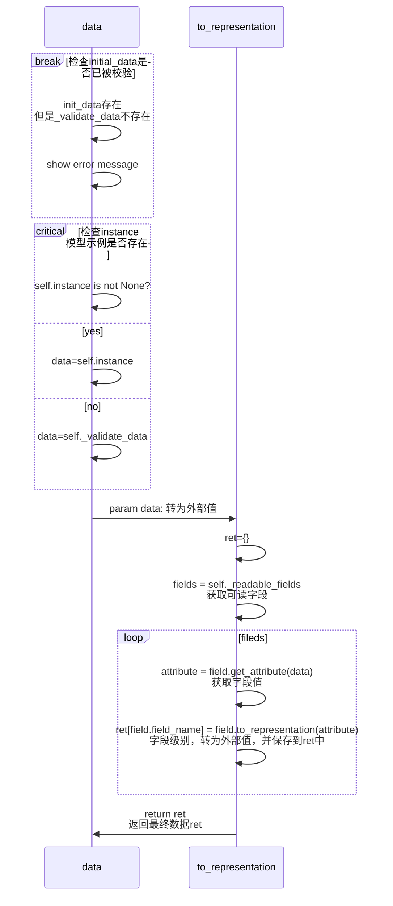

# Serializer 序列化器

## 序列化器执行流程

```python
from rest_framework import serializers

class PeopleSerializer(serializers.Serializer):
    name = serializers.CharField(max_length=100)
    age = serializers.IntegerField()

zhang_san = {
    "name": "zhangsan",
    "age": 20
}

zhangsan_serializer = PeopleSerializer(data=zhang_san)
zhangsan_serializer.is_valid()
print(zhangsan_serializer.data)
# >> {'name': 'zhangsan', 'age': 20}
```

### Serializer 的实例化流程



### Serializer序列化器data数据校验流程(is_valid)

#### 1、简易流程图



#### 2、详细校验流程



### Serializer.data 获取数据流程




