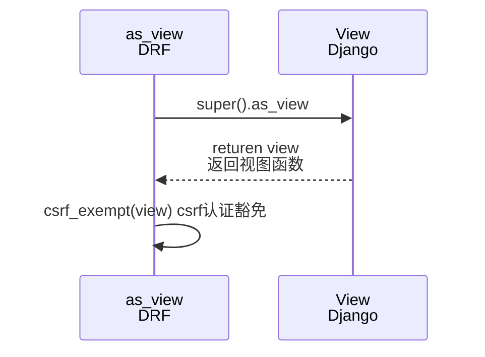
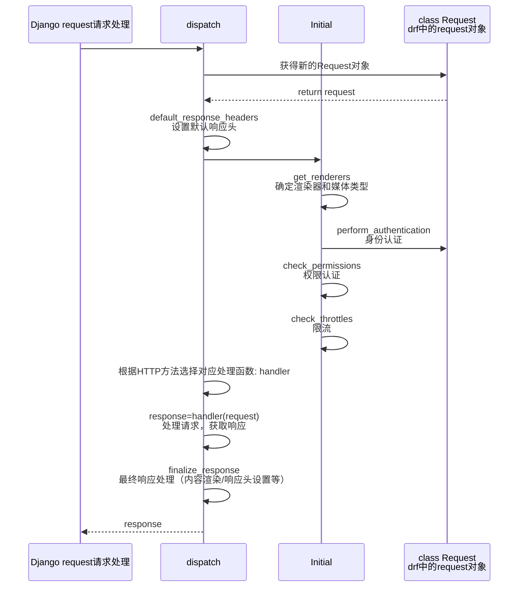

# APIView

## APIview.as_view 执行流程

```mermaid
sequenceDiagram
    participant  A as as_view<br>DRF   
    participant E as View<br>Django

    A->>E: super().as_view
    E-->>A: returen view<br>返回视图函数
    A->>A: csrf_exempt(view) csrf认证豁免
    
   
```

## APIVIew.dispatch: request请求处理执行流程

```mermaid
sequenceDiagram
    participant  A as Django request请求处理 
    participant  B as dispatch
    participant  C as Initial
    participant  D as class Request<br>drf中的request对象
    
    A->>B: 
    B->>D: 获得新的Request对象
    D-->>B: return request
    B->>B: default_response_headers<br>设置默认响应头
    B->>C:  
    C->>C: get_renderers<br>确定渲染器和媒体类型
    C->>D: perform_authentication<br>身份认证
    C->>C: check_permissions<br>权限认证
    C->>C: check_throttles<br>限流

    B->>B: 根据HTTP方法选择对应处理函数: handler
    B->>B: response=handler(request)<br>处理请求，获取响应
    B->>B: finalize_response<br>最终响应处理（内容渲染/响应头设置等） 
    B-->>A: response
```

