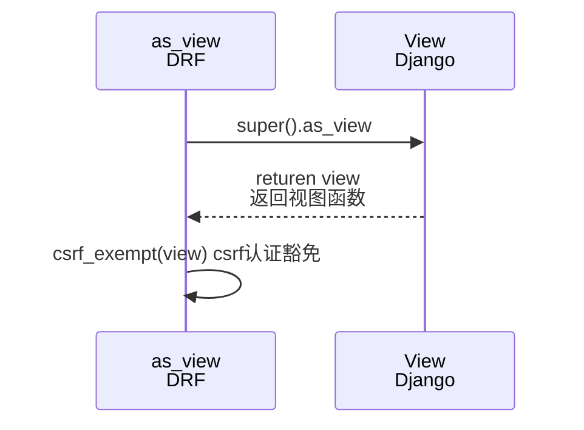
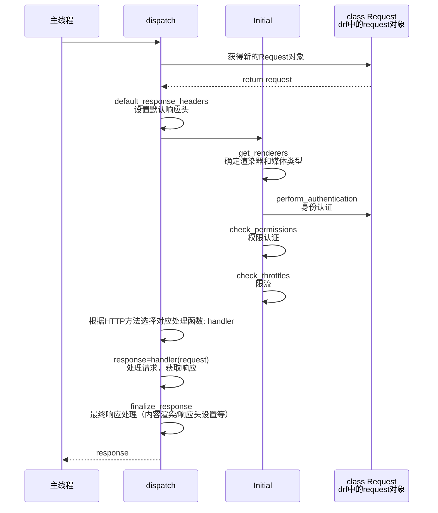
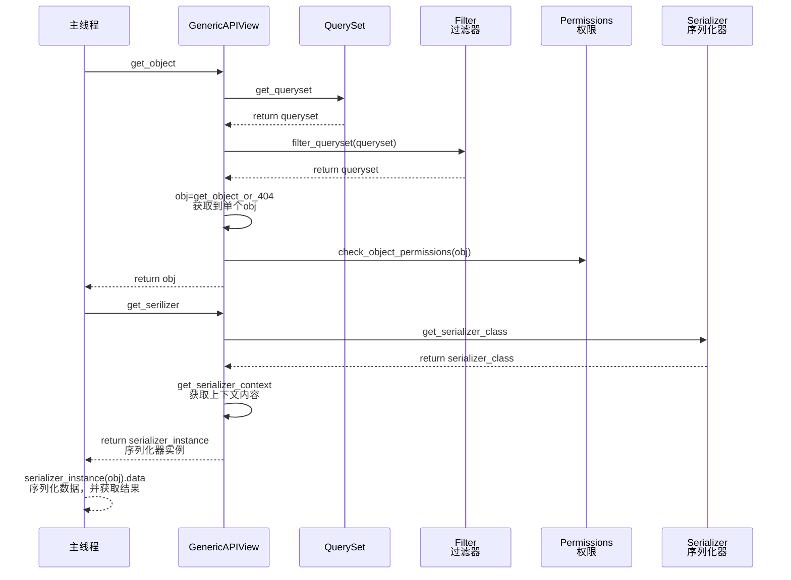
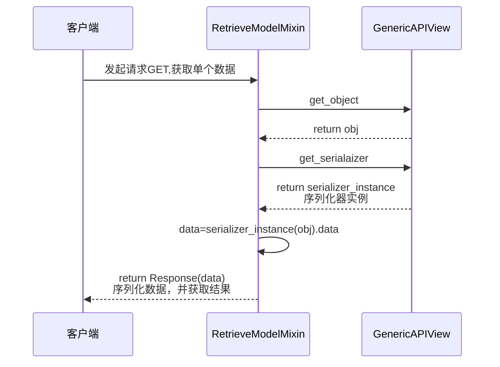
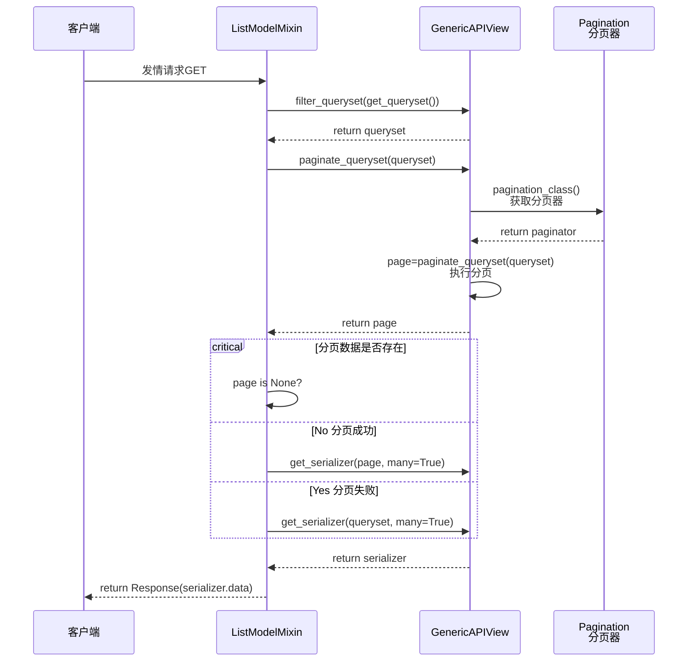
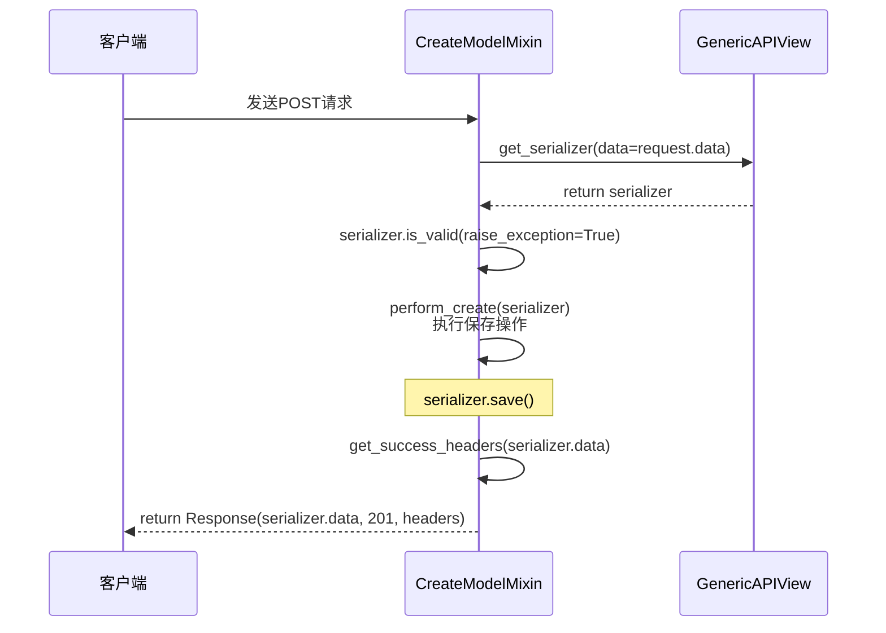
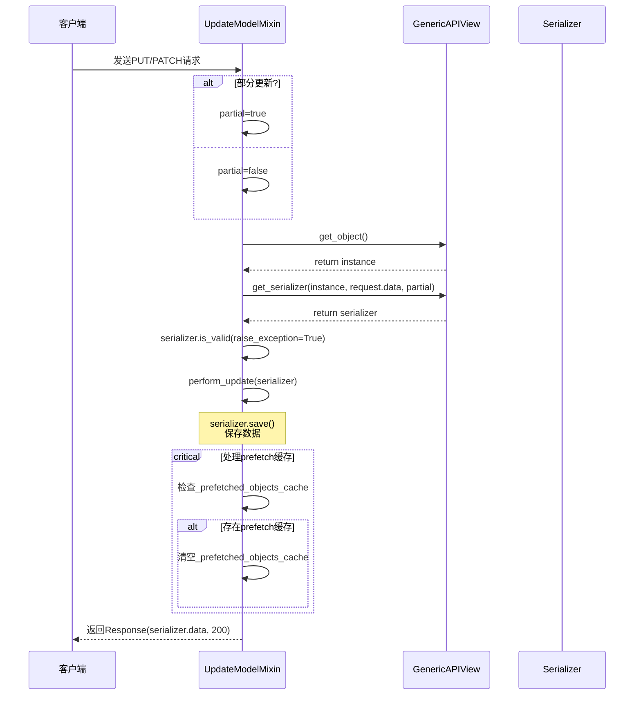
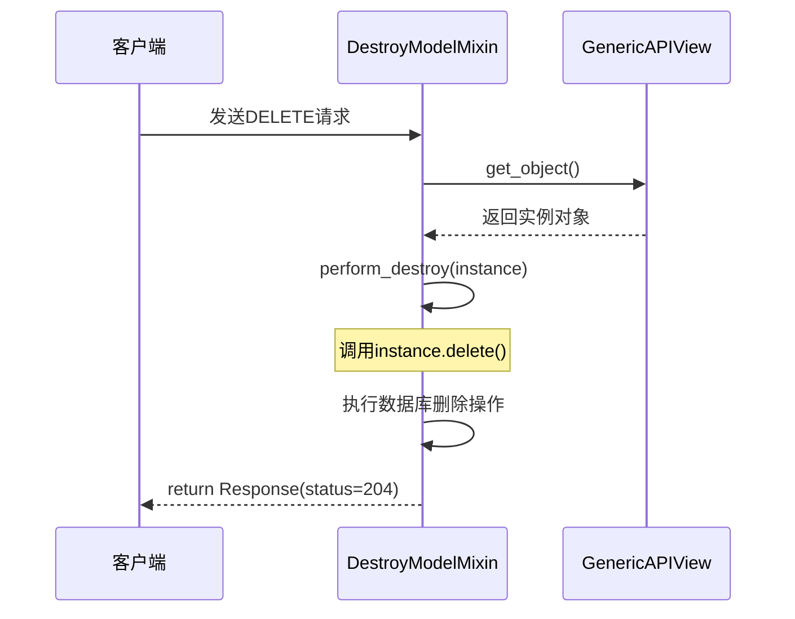

# APIView

## APIview.as_view 执行流程

## APIVIew.dispatch: request请求处理执行流程

## GenericAPIView 获取单个数据

## RetrieveModelViewSet(RetrieveModelMixin,GenericViewSet)

## ListModelViewSet(ListModelMixin,GenericViewSet)

## CreateModelViewSet(CreateModelMixin,GenericViewSet)

## UpdateModelViewSet(UpdateModelMixin,GenericViewSet)

## DestroyModelViewSet(DestroyModelMixin,GenericViewSet)

